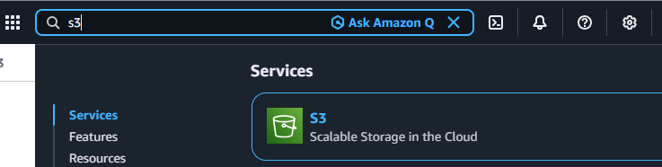
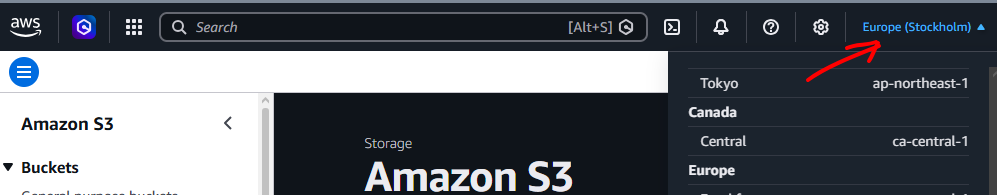
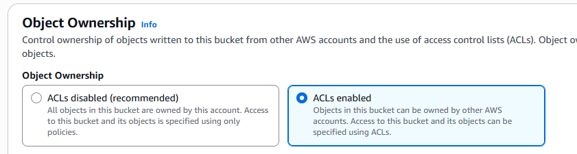
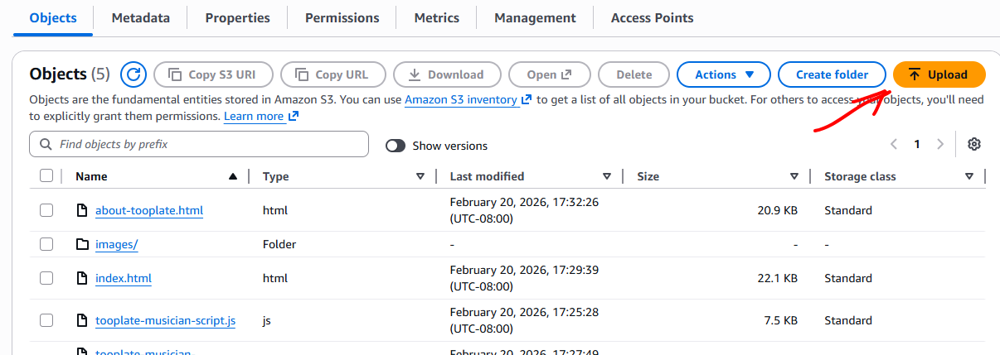
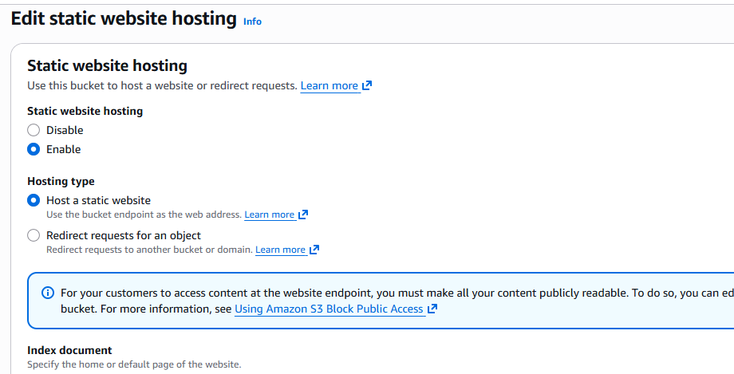
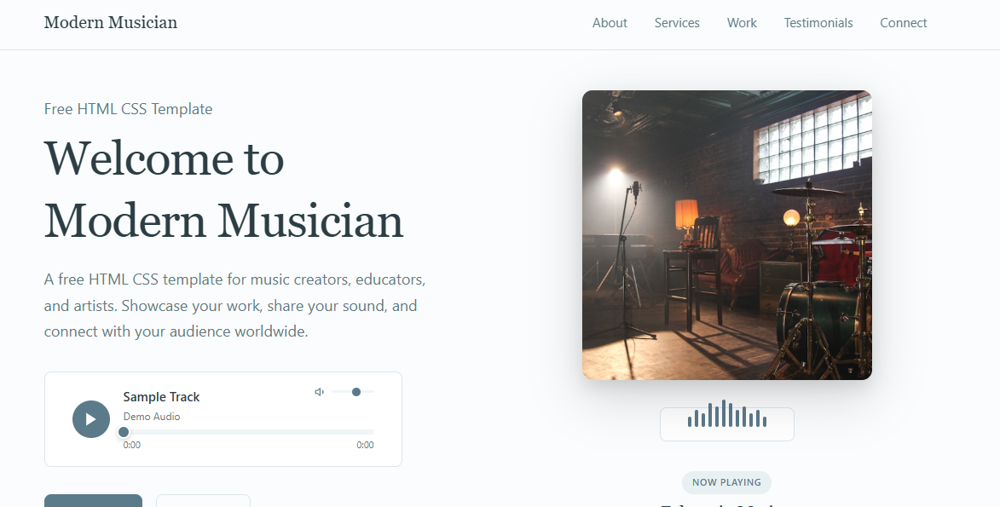

# AWS-S3-Static-Website-Project
# Overview 

This project demonstrates how to host a static website using Amazon S3. The website is a simple HTML page with associated assets, fully hosted on S3, showcasing how to leverage AWS for static content delivery.

## Step-by-Step Process for Hosting a Static Website Using AWS S3 Bucket 
* ### Create a Bucket in Amazon S3
* ### Upload Website Content to your Bucket
* ### Configure a Static Website on Amazon S3
* ### Access Amazon S3 Static Website
## Step 1: Create a Bucket in Amazon S3
 1. Login to the [Amazon Management Console](https://aws.amazon.com)
 2. In the Management Console, search for `S3`

 3. Choose Create Bucket
    *  Give it a unique Bucket name (e.g, my-amazon-web-bucket).
    * Select the AWS Region closest to your location. You can find the Region selector in the top right corner of the AWS Management Console, next to your account name.

 4. Enable ACLs:
    * While creating the bucket, navigate to the Object Ownership section and select ACLs enabled.
    * This option allows you to manage and customize permissions for individual objects within the bucket.
 

 ## Step 2: Upload Website Content to your Bucket
   * Upload the index.html files along with the extracted folder contents to the S3 Bucket.
   * Make sure the original folder structure is maintained during the upload to ensure the website functions correctly.

## Step 3: Configure a Static Website on Amazon S3
   * Open your bucket in the `Amazon S3 console`.
   * Navigate to the Properties tab.
   * Scroll down to the Static website hosting section and click Enable.
   * Enter `index.html` as the Index document.
   * (Optional) Specify a custom error page such as error.html under Error document.
#### Save Changes

## Step 4: Access Amazon S3 Static Website
   * Access your website using the bucket’s public URL. It usually follows this format:
     
     `http://your-bucket-name.s3-website-region.amazonaws.com`
     

## Managing Public Access using ACLs (Access Control Lists)
   * Access Control Lists (ACLs) define who can access your S3 resources and what level of access they have. In this project, ACLs were configured to enable public access to the static website files.
## Why use ACLs?
   * ACLs let you assign specific read or write permissions to individual AWS accounts or make objects publicly accessible. They offer more fine-grained control at the object level compared to bucket policies.
